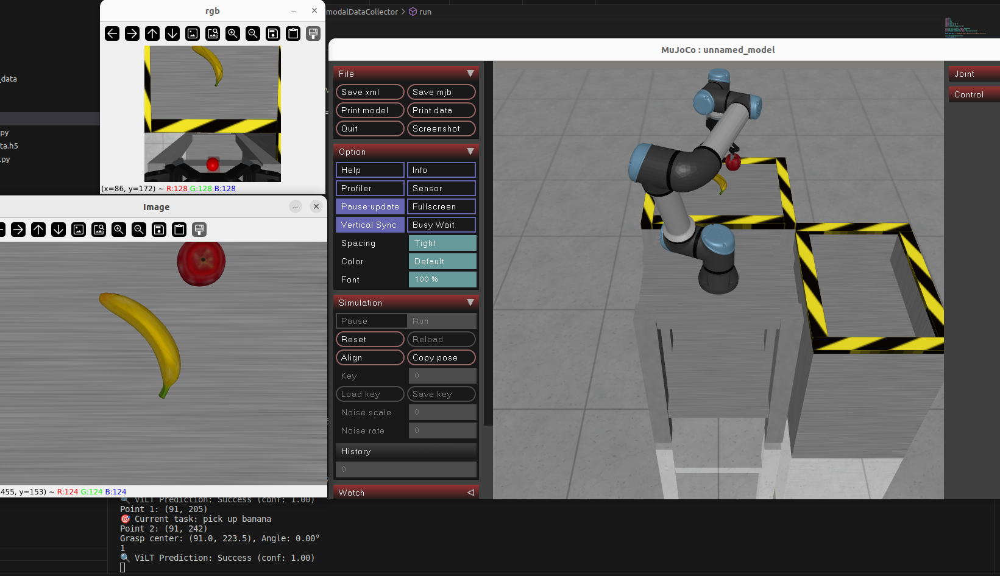
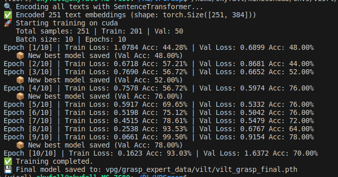

# GraspClassifer
## Description
**Scence**

 **Two algorithmns:**
- **DQN**: A reinforcement learning (RL) approach that trains a grasp affordance network to predict the quality of planar grasps from visual inputs. The agent learns an optimal grasping policy by maximizing cumulative reward through interaction with the environment.
- **ViLT (Vision-and-Language Transformer)**: A ViT-based architecture adapted as a grasp success discriminator. It jointly encodes visual scene features and task-specific embedding(embed by SBERT 'all-MiniLM-L6-v2') to evaluate whether a grasp is successful.

## Results
**ViLT Training&Evaluaion Metric:**
- **Metric:** Task conditioned binary classification.
- **Training Logger**

| Train | Validate | Simulation deploy |
|----------|----------|----------|
| 93.03%  | 70.00%   | Cell C   |
